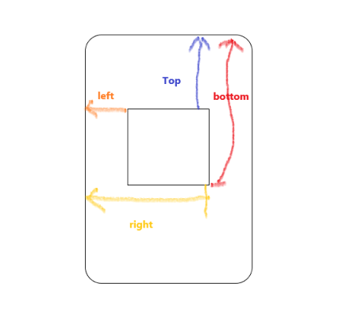

# 知识点整理

## 页面布局

- 假设高度已知，请写出三栏布局，其中左栏、右栏宽度各为 300px,中间自适应
  - 浮动布局
  - 定位布局
  - flexbox 布局
  - 表格布局
  - 网格布局
  - [代码实例点这里](./DOM/三栏布局.html)
- 高度未知，左右固定宽度，中间自适应
- 上下高度固定，中间自适应
- 左侧固定，右侧自适应
- 右侧固定，左侧自适应
- 左右高度自适应同步

## CSS 盒模型

- 基本概念：W3C 标准模型 和 IE 模型

- `margin`,`border`,`padding`,`content`

  - 区别：

    - 高度与宽度的计算方式不同
    - W3C 标准盒模型的宽高 === `content` 的宽高
    - IE 盒模型的宽高 === `content + padding + border`

  - CSS 如何设置盒模型

    - `box-sizing: content-box` W3C 标准模型 （浏览器默认）
    - `box-sizing: border-box` IE 模型

  - JS 如何设置和获取盒模型对应的宽，高

    1. `dom.style.width/height` 只能取到行内样式的，style 标签内定义的样式和 link 外链的样式是取不到的。
    2. `dom.currentStyle.width/height` 可以取到页面渲染完成后，DOM 节点上的当前样式，但是只有 IE 浏览器 才支持。
    3. `window.getComputedStyle(dom).widht/height` 此种方式与`currentStyle` 作用相同，但是兼容更多浏览器，通用性更好。
    4. `dom.getBoundingClientRect().width/height` **getBoundingClientRect**用于获取某个元素相对于视窗的位置集合。集合中有 top, right, bottom, left 等属性。
       

    ### 边距重叠解决方案(BFC)

    - 什么是 BFC？

      1. `Block Formatting Context` 块级格式化上下文，W3C 的定义：

      > 浮动元素和绝对定位元素，非块级盒子的块级容器（例如 `inline-blocks`, `table-cells`, 和 `table-captions`），以及`overflow`值不为`“visiable”`的块级盒子，都会为他们的内容创建新的 BFC（块级格式上下文）。

      1. BFC 是一个独立的布局环境，其中的元素布局是不受外界的影响，并且在一个 BFC 中，块盒与行盒（行盒由一行中所有的内联元素所组成）都会垂直的沿着其父元素的边框排列。
      2. BFC 的区域不会与浮动区域的容器重叠
      3. BFC 是一个页面上的独立的容器，外面的元素不会影响 BFC 里的元素，反过来，里面的也不会影响外面的
      4. 计算 BFC 高度的时候，浮动元素也会参与计算

    - 如何创建 BFC ?

      1. `float` 的值不为 `none`
      2. `position` 的值不为 `static`或者 `relative`
      3. `display` 的值为 `table-cell`,`table-caption`,`inline-block`,`flex`,`inline-flex`中的其中一个
      4. `overflow` 的值不为 `visible`

## DOM 事件

### DOM 事件的级别

- DOM0 `element.onclick = function(){}` || `<a onclick="alert(1)"></a>`
  1. 直接绑定到 DOM 节点上的
  2. 清理 DOM0 事件时，只需要给该事件赋值为 null 。`element.onclick = null`
  3. 同一个元素的同一种事件只能绑定一个函数，否则后面的函数会覆盖之前的函数
  4. 不存在兼容性问题
- DOM2 `element.addEventListener('click', function(){}, false)` || IE `element.attachEvent('onclick', function(){})`
  1. dom2 是通过 `addEventListener` 绑定事件。
  2. 同一个元素可以绑定多个事件，按照绑定顺序执行
  3. 清楚事件时，使用 `removeEventListener`。不能移除匿名添加的函数  
     `input.removeEventListener( "click" ,a)`
  4. `addEventListener` 有三个参数
     - 第一个参数是事件名
     - 第二个参数是事件处理函数
     - 第三个参数是 true 表示在捕获阶段调用，false 表示在冒泡阶段调用。
- DOM3 绑定方式和 DOM2 相同，新增了更多的事件类型。同时也允许自定义事件。

### DOM 事件模型

- 捕获
  - 从外层到内层
- 冒泡
  - 从内层到外层

### DOM 事件流

- 事件通过捕获到达目标元素，再通过冒泡上传到 window 对象
- DOM 事件捕获的具体流程
  - 捕获：`window` > `document` > `html` > `body` > `父级dom节点` > `目标元素`
  - 冒泡：与捕获反之 `目标元素`> ... > `window`
  - html 节点 通过 js 的获取方法 `document.documentElement`
- Event 对象的常见应用
  - `event.preventDefault()` 阻止默认事件行为
  - `event.stopPropagation()` 阻止冒泡行为
  - `event.stopImmediateProgation()`一个元素注册多个事件，阻止除了第一个事件的执行
  - `event.currentTarget`当前所绑定的事件
  - `event.target`当前被点击的元素

### 自定义事件

- `Event`

  ```js
  // 创建自定义事件
  var eve = new Event('custome')

  // 注册自定义事件
  dom.addEventListener('custome', function() {
    console.log('custome')
  })

  // 触发自定义事件
  dom.diapatchEvent(eve)
  ```

- `CustomeEvent` 可以跟一个 Object ，用来指定自定义参数

## HTTP 协议

### HTTP 协议的主要特点

1. 简单快速
   - 客户向服务器请求服务时，只需传送请求方法和路径。请求方法常用的有 GET、HEAD、POST。每种方法规定了客户与服务器联系的类型不同。由于 HTTP 协议简单，使得 HTTP 服务器的程序规模小，因而通信速度很快。
2. 灵活
   - HTTP 允许传输任意类型的数据对象。正在传输的类型由 Content-Type 加以标记。
3. 无连接
   - 无连接的含义是限制每次连接只处理一个请求。服务器处理完客户的请求，并收到客户的应答后，即断开连接。采用这种方式可以节省传输时间。
4. 无状态
   - HTTP 协议是无状态协议。无状态是指协议对于事务处理没有记忆能力。缺少状态意味着如果后续处理需要前面的信息，则它必须重传，这样可能导致每次连接传送的数据量增大。另一方面，在服务器不需要先前信息时它的应答就较快。
5. 支持 B/S 及 C/S 模式。

### HTTP 报文的组成部分

1. 请求报文
   - 请求行
     - HTTP 方法
     - 资源路径 URL
     - HTTP 协议版本
   - 请求头
     - 包括一些访问的域名、用户代理、Cookie 等信息；
   - 空行
     - 代表请求头的结束，请求体的开始
   - 请求体
     - 请求数
2. 响应报文
   - 状态行
     - HTTP 协议版本
     - 响应状态码
   - 响应头
     - 响应时间
     - 数据格式
     - 服务器相关信息
   - 空行
     - 响应头的结束，响应体开始
   - 响应体
     - 响应的数据

### HTTP 方法

- GET --- 获取资源
- POST --- 传输资源
- PUT --- 更新资源
- DELETE --- 删除资源
- HEAD 获得报文首部

### post 和 get 的区别

- **GET 在浏览器回退时是无害的，而 POST 会再次提交请求**
- GET 产生的 URL 地址可以被收藏，而 POST 不可以
- **GET 请求会被浏览器主动缓存，而 POST 不会，除非手动设置**
- GET 请求只能进行 URL 编码，而 POST 支持多种编码方式
- **GET 请求参数会被完整保留在浏览器历史记录里，而 POST 中的参数不会被保留**
- **GET 请求在 URL 中传送的参数是有长度限制的，大部分为 2KB，不同浏览器不一样，而 POST 没有限制**
- 对参数的数据类型，GET 只接受 ASCII 字符，而 POST 没有限制
- GET 比 POST 更不安全，因为参数直接暴露在 URL 上，所以不能用来传递敏感信息
- **GET 参数通过 URL 传递，POST 放在 Request body 中**

### HTTP 状态码

·

- | 状态码 |             含义              |
  | :----: | :---------------------------: |
  |  1XX   | HTTP 请求已接受，继续处理请求 |
  |  2XX   |  HTTP 请求成功，已经处理完成  |
  |  3XX   |  HTTP 请求被重定向到其他目录  |
  |  4XX   |        客户端出现错误         |
  |  5XX   |        服务端出现错误         |

- 常见状态码

  - 200 --- OK/请求成功，处理完毕
  - 206 --- 客户端发送了一个带有 Range 头的 GET 请求，服务器完成了它
  - 301 --- 请求永久重定向
  - 302 --- 请求临时重定向
  - 304 --- 请求被重定向到客户端本地缓存
  - 400 --- 客户端存在请求语法错误
  - 401 --- 客户端请求没有经过授权
  - 403 --- 客户端的请求被服务器拒绝，一般为客户端没有访问权限
  - 404 --- 客户端请求的 URL 在服务端不存在
  - 500 --- 服务端永久错误
  - 503 --- 服务端发生临时错误

### 什么是持久化连接

- HTTP/1.1 版本才支持持久化连接
- HTTP 协议采用"请求-应答"模式，当使用普通模式，即非 Keep-Alive 模式时，每个请求/应答，客户和服务器都要新建一个连接，完成之后立即断开连接（HTTP 协议为无连接协议）
- 当使用 Keep-Alive 模式（又称持久连接、连接重用）时， Keep-Alive 功能使客户端到服务器端的连接持续有效，当出现对服务器的后继请求时， Keep-Alive 功能避免了建立或者重新建立连接。

### 什么是管线化

- 在使用持久连接的情况下，某个连接上的消息传递类似于

  请求 1 -> 响应 1 -> 请求 2 -> 响应 2 -> 请求 3 -> 响应 3

- 而管线化的连接，消息传递类似这样

  请求 1 -> 请求 2 -> 请求 3 -> 响应 1 -> 响应 2 -> 响应 3

- 管线化机制通过持久连接完成，仅 HTTP/1.1 支持此技术

- 只有 GET 和 HEAD 请求可以进行管线化，而 POST 则有所限制

- 初次创建连接时不应启动管线机制，因为对方（服务器）不一定支持 HTTP/1.1 版本的协议

- 管线化不会影响响应到来的顺序，如上面的例子所示，响应返回的顺序并未改变

- HTTP/1.1 要求服务器端支持管线化，但并不要求服务器端也对响应进行管线化处理，只是要求对于管线化的请求不失败即可。

- 由于上面提到的服务器端问题，开启管线化很可能并不会带来大部幅度的性能提升，而且很多服务器端和代理程序对管线化的支持并不好，因此现代浏览器默认并未开启管线化支持。

## 原型链

### 创建对象有几种方法

1. 字面量对象

   ```js
   var obj = { name: 'obj' }
   ```

2. 显式构造函数

   ```js
   var obj1 = new Object({ name: 'obj1' })

   var Person = function(name) {
     this.name = name
   }
   var obj2 = new Person('obj2')
   ```

3. Object.create

   ```js
   var P = { name: 'obj3' }
   var obj3 = Object.create(P)
   ```

### 原型、构造函数、实力、原型链

### instanceof 的原理

### new 运算符

## 面向对象

## 通信

跨域

## 安全

XSS

## 算法
