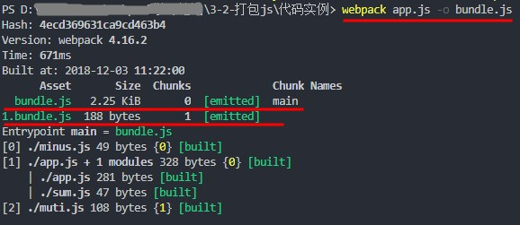
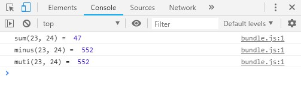

# webpack 起步 - 打包 JS 文件

## 1. 使用 NPM 安装 webpack

要安装最新版本或者特定版本，请运行一下命令：

```shell
  npm install webpack --save-dev
  npm install webpack@<version> --save-dev
```

## 2. 在目录下新建 `app.js` 作为入口文件，新建 `sum.js, minus.js, muti.js`三种模块规范，还有`index.html`

`app.js :`

```js
// es module
import sum from './sum'

// commonjs
const minus = require('./minus')

// amd
require(['./muti'], function(muti) {
  console.log('muti(23, 24) = ', muti(23, 24))
})

console.log('sum(23, 24) = ', sum(23, 24))
console.log('minus(23, 24) = ', minus(23, 24))
```

`sum.js:`

```js
// es module
export default (x, y) => {
  return x + y
}
```

`minus.js:`

```js
// commonjs
module.exports = (x, y) => {
  return x * y
}
```

`muti.js:`

```js
// amd
define(function(require, factory) {
  'use strict'
  return function(a, b) {
    return a * b
  }
})
```

`index.html:`  
我们把`bundle.js`作为出口文件，所以引入 `bundle.js`

```html
<!DOCTYPE html>
<html lang="en">
  <head>
    <meta charset="UTF-8" />
    <title>Document</title>
  </head>
  <body>
    // 引入 bundle.js
    <script src="./bundle.js"></script>
  </body>
</html>
```

## 3. 使用 webpack 命令打包

- 使用配置文件的用法  
  `webpack [--config webpack.config.js]`
- 不使用配置文件的用法  
  `webpack <entry> [<entry>] -o <output>`

- `<entry>`

  > 一个文件名或一组被命名的文件名，作为构建项目的入口起点。你可以传递多个入口（每个入口在启动时加载）。如果传递一个形式为 `<name> = <request>` 的键值对，则可以创建一个额外的入口起点。它将被映射到配置选项(configuration option)的 entry 属性。

- `<output>`

  > 要保存的 bundled 文件的路径和文件名。它将映射到配置选项 output.path 和 output.filename。

**打包成功后，目录下就会多一个 `bundle.js` 文件。运行结果如下图：**



_我们看到打包出来了两个文件，这个是因为 amd 规范是异步加载的，所以单独的形成了一个 chunk_

## 4. 打开`index.html` 打开控制台，就能看到运行结果了


